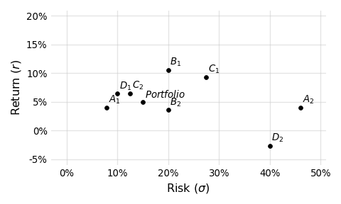
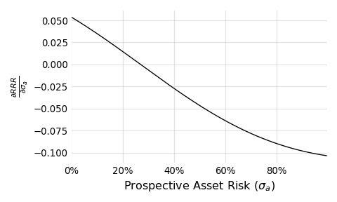

Introduction
------------

There's a short preference test in this paper that most readers, if not all, will answer incorrectly. It's a "preference test" (and not a quiz) because selections should be made without calculation or computation. I'm looking to test your intuition.

Below I argue for why we should care about where our intuition is leading us, why it might be creating blind spots and how we can do better. Specifically, I attempt to demonstrate the limitations of financial judgement based on return to risk ratios (i.e. Sharpe ratios) and how something like this might be better:

$$
\frac{RRR_a}{\rho} > RRR_p
$$

$$
RRR_a > \rho \times RRR_p
$$

Don't worry, we'll come back to these.

Intuition
---------

Practitioners in the hedge fund industry must often rely on intuition. In some ways, given the highly quantitative nature of the industry, this is surprising; in other ways it isn't. The types of problems regularly encountered can be extremely complicated, requiring involved computation for, at best, reasonable approximations. Successful individuals develop heuristics (shortcuts) to more efficiently guide their day-to-day filtering of opportunities. They develop a sense for what should foot and what shouldn't. It's an element of discretion, molded by experience, that manifests in small but important decisions across the sector everyday:

-   Does this manager's presentation warrant follow up?
-   Does this line of research show promise?
-   How do I feel about the risk we're taking?
-   Does this make sense?

Granted, these are questions we'd ideally approach quantitatively, but this takes time we don't always have.

A common instance of this discretion is visible in the evaluation of performance statistics. Hedge fund investors are confronted with an amazing amount of data: daily returns, monthly returns, return statistics, sector exposures, positions, correlation matrices and more. Given this mountain of information, it's necessary to employ time saving tools to filter true prospects from everything else.

One such tool is the return to risk ratio ($RRR$). It might seem strange to call the $RRR$ a "tool," especially in the context of shortcuts and heuristics, since the ratio has such a strong theoretical source: William Sharpe[^1]. But it helps to remember that the $RRR$ is, indeed, a deliberate simplification, facilitating the comparison of assets of different risks "as long as the correlations of the \[assets\] with other relevant asset classes are reasonably similar" ([Sharpe's words](https://web.stanford.edu/~wfsharpe/art/sr/sr.htm)). So while the $RRR$ and Sharpe ratio have their limitations, you'd be hard pressed to find any presentation of hedge fund performance that didn't show them. The statistic carries an importance, a currency, derived from its simplicity and implication of skill---even though confidently quantifying "skill" is probably more complicated.

In the next section, you'll be asked to put yourself in the shoes of a portfolio manager. You'll be presented with a series of investment preference tests designed to examine your ability to pick superior assets. It will be tempting to reach for a spreadsheet or Python or R, but don't. Try and let intuition guide you. And while this may feel frivolous, if you were ever presented with statistics describing some potential investment and, without deliberately calculating its potential impact on your portfolio, decided it wasn't for you, then you've made choices like this before.

Preference Tests
----------------

Below are four preference tests where you'll need to pick one of two assets (i.e. $A_1$ or $A_2$; $B_1$ or $B_2$; etc.). In each, assume you already own a portfolio that exhibits a return of 5% and a risk of 15%. Also, pretend you're seeking to allocate capital such that the resulting weights will be split 90% to your current portfolio and 10% to your asset choice. This asset will therefore play a small but not unimportant role in the new portfolio. Lastly, assume you're objective is to maximize your portfolio's return over risk ratio ($RRR$).[^2]

$$
\begin{array}{r|c|c|c}
\text{}                   & A_1    & or & A_2 \\
\hline{}
\text{Return }(r)       & 4.00\% &    & 4.00\% \\
\text{Risk }(\sigma)      & 7.96\% &    & 46.04\% \\
\text{Correlation }(\rho) & -0.2   &    & -0.2
\end{array}
$$

$$
\begin{array}{r|c|c|c}
\text{}                   & B_1     & or & B_2  \\
\hline
\text{Return }(r)       & 10.54\% &    & 3.57\% \\
\text{Risk }(\sigma)      & 20.00\% &    & 20.00\% \\
\text{Correlation }(\rho) & 0.8     &    & -0.2
\end{array}
$$

$$
\begin{array}{r|c|c|c}
\text{}                   & C_1     & or & C_2 \\
\hline{}
\text{Return }(r)       & 9.33\%  &    & 6.50\% \\
\text{Risk }(\sigma)      & 27.50\% &    & 12.50\% \\
\text{Correlation }(\rho) & 0.4     &    & 0.4
\end{array}
$$

$$
\begin{array}{r|c|c|c}
\text{}                   & D_1     & or & D_2 \\
\hline{}
\text{Return }(r)       & 6.43\%  &    & -2.64\% \\
\text{Risk }(\sigma)      & 10.00\% &    & 40.00\% \\
\text{Correlation }(\rho) & 0.5     &    & -0.6
\end{array}
$$

After presenting this test to several people, a typical set of answers started to emerge:

1.  $A_1$ was preferred to $A_2$. With $A_1$, for the same return and correlation, you receive nearly 6 times less risk.
2.  $B_1$ was slightly preferred to $B_2$. For the same risk, $B_1$ delivers much more return, though $B_2$'s correlation is better.
3.  $C_2$ was preferred. It's $RRR$ is higher (about 0.52 versus about 0.34).
4.  $D_1$ was preferred to $D_2$. $D_1$'s return to risk ratio ($RRR$) is much higher. $D_2$'s return is negative.

Results
-------

To reveal the results and see how far intuition can get you, we'll start with the case of $A_1$ and $A_2$, which should exhibit the most consensus. Most, if not all, will have chosen $A_1$ over $A_2$. For the same return and correlation you receive much, much less risk. Let's calculate the portfolio impact of each investment and see exactly how much better you are with $A_1$ over $A_2$:

### Portfolio Return (R)

Since the returns of the prospective assets $A_1$ and $A_2$ are identical, the resulting portfolio returns will be identical as well:

$$
\begin{aligned}
R & = w_p r_p + w_a r_a \\
R & = 0.9 \times 0.05 + 0.1 \times 0.04 \\
R & = 0.049 \\
\end{aligned}
$$

$$
\begin{aligned}
Where: & \\
R & = \text{return of the portfolio after allocating to the prospective asset} \\
r_p & = \text{return of the current portfolio} \\
r_a & = \text{return of the prospective asset} \\
w_p & = \text{weight of the current portfolio post-allocation} \\
w_a & = \text{weight of the prospective asset post-allocation} \\
w_a & = (1 - w_p)
\end{aligned}
$$

### Portfolio Risk (S)

Now, because the risks of $A_1$ and $A_2$ are so different, we expect a logical preference to very clearly emerge below. We'll first calculate the portfolio's resulting risk ($S$) for $A_1$:

$$
\begin{aligned}
S & = \sqrt{w_p^2 \sigma_p^2 + w_a^2 \sigma_a^2 + 2 w_p w_a \sigma_p \sigma_a \rho} \\
S & = \sqrt{(0.9 \times 0.15)^2 + (0.1 \times 0.0796)^2 + 2 \times 0.9 \times 0.1 \times 0.15 \times 0.0796 \times -0.2} \\
S & = \sqrt{0.018225 + 0.0000633616 - 0.00042984} \\
S & = \sqrt{0.0178585216} \\
S & = 0.13363577964 \\
S & \approx 13.363...\% 
\end{aligned}
$$

$$
\begin{aligned}
Where: & \\
S & = \text{risk of the portfolio after allocating to the prospective asset} \\
\sigma_p & = \text{risk of the current portfolio} \\
\sigma_a & = \text{risk of the prospective asset} \\
\rho & = \text{correlation between the current portfolio and the prospective asset} \\
\end{aligned}
$$

If we take the ratio of $R$ to $S$, the resulting portfolio's $RRR$ is now about 0.3667, which represents a 10% improvement. Not bad.

Let's see how much better that is than $A_2$:

$$
\begin{aligned}
S & = \sqrt{w_p^2 \sigma_p^2 + w_a^2 \sigma_a^2 + 2 w_p w_a \sigma_p \sigma_a \rho} \\
S & = \sqrt{(0.9 \times 0.15)^2 + (0.1 \times 0.4604)^2 + 2 \times 0.9 \times 0.1 \times 0.15 \times 0.4604 \times -0.2} \\
S & = \sqrt{0.018225 + 0.0021196816 - 0.00248616} \\
S & = \sqrt{0.0178585216} \\
S & = 0.13363577964 \\
S & \approx 13.363...\% 
\end{aligned}
$$

Um, what?
---------

There are no tricks here. Feel free to replicate the math yourself. You'll find that $A_1$ and $A_2$ deliver the exact same change to the portfolio's risk, which, since their returns are identical, results in the same +10% change to the portfolio's $RRR$.[^3]

Think about that. We essentially took an asset ($A_1$), added nearly 40% more risk and ended up with the same resulting portfolio. How's that possible? Look at the formula for the post-allocation risk ($S$), specifically the last two terms: $w_a^2 \sigma_a^2$ and $2 w_p w_a \sigma_p \sigma_a \rho$. Respectively, these items describe risk contributions from the prospective asset individually and in combination with the original portfolio. As we increase the asset's risk, the first term grows exponentially, and the second term shrinks linearly (remember, the correlation is negative). It turns out that, at least temporarily, the shrinking effect from the negative correlation outweighs the exponential term. We can show this graphically by plotting how these terms and their sum change as we adjust the asset's risk:

For a while, the red line, which describes the risk reduction from the negatively correlated combination, wins out, allowing for pairs like $A_1$ and $A_2$.

When I first discovered the math behind these strange asset pairs (see the Appendix for more details), I remember feeling uneasy. We're strongly trained to view more risk, holding all else constant, as a bad thing. In some ways, it's a sort of tenant of sound financial thinking. But here, in this example, that's just not the case.

I doubt at this point you'll be too surprised to learn that all the other assets in the preference test also deliver the exact same 10% improvement to the portfolio's return to risk ratio. Each asset from the test is, from a quantitative perspective, equivalent. You were right (and wrong) whatever you picked.

Visualizing equivalence
-----------------------

In order to make sense of the equivalence behind these seemingly disparate assets, let's first plot each them in a risk-return space:

At first glance it's hard to see the "equivalence." Looking at this plot, it is natural to gravitate towards points higher and to the left. In this light, $A_1$, $D_1$, $C_2$, $B_1$ look preferential. And if the $RRR$ of each asset is our sole consideration, then these truly are preferential assets. But the story is incomplete without considering correlation. When we do that, the picture begins to take shape:

Each line drawn in this plot represents a class of assets that:

1.  Share some correlation to the portfolio (0.8, 0.5, 0.4, -0.2, or -0.6)
2.  Deliver a 10% improvement, measured in $RRR$, to the original portfolio when allocated at a 10% weight

With the added correlation lines it's easier to see how, as the correlation drops (corresponding to lines of "cooler" coloring), less return is required to deliver the same 10% improvement. Put differently, return is traded for lower correlation such that the resulting portfolio improvement remains constant.

Correlation is what connects these assets. While that's obvious now, it wasn't when you were selecting preferences. Whatever you picked, you still picked, and I think this proves two important things:

1.  How difficult it is to internalize correlation
2.  At the same time, how important correlation really is

This is a problem, right? $RRR$'s and Sharpe ratios are mentally portable. They are easy, compact and can be helpful when correlations are "reasonably similar." But even by that logic you'd have developed illogical preferences for $A_1$ (over $A_2$) and $C_2$ (over $C_1$). It seems, especially within the world of hedge funds where lower correlations to traditional assets are more common, something better is required that:

1.  Incorporates correlation
2.  Remains simple to calculate

Luckily, I develop just the formula below. While being remarkably simple, the formula is surprisingly difficult to derive, which may explain why I haven't seen it used much. Starting with the idea of an indifference curve, I'll reveal the intuition and a bit of the math behind the derivation.

Indifference curves
-------------------

An indifference curve, in the traditional context of economics, connects combinations of variables into a curve for which a consumer is indifferent. They are indifferent because each point on one of these curves corresponds to the same level of utility or happiness or reward.

In the context of portfolio mathematics we'll connect combinations of prospective asset return, risk and correlation for which an allocator is indifferent. Since the idea of utility translates nicely into $RRR$s (we're generally happier with more return per unit of risk), what we're really examining are different kinds of prospective assets that deliver the exact same change to the portfolio. And this should sound familiar. In the preference test, we constructed a set of 8 assets that exhibited very different returns, risks and correlations, for which we were indifferent; they all delivered the same +10% change to the portfolio's $RRR$.

To derive the new formula, we'll focus not on assets that deliver a +10% change, but those that deliver no change. This is a little confusing since it's hard to see the practical value of such an exercise. Essentially these are assets that, when added at some weight ($w_a$), do not change the portfolio's return over risk. It's important to realize that such an asset doesn't have to be identical to the portfolio with a correlation of 1.0. It can exhibit any correlation or risk or return subject to some quantitative constraints. For instance if some prospective asset delivers relatively low return, it will obviously lower the portfolio's return. It must balance this with attractive (i.e. low) correlation that will serve to reduce the portfolio's risk. If the risk is lowered enough as to offset the lower return, the ratio of the two is preserved and the portfolio's $RRR$ is unchanged.

We can express this idea formally:

$$
\frac{r_p}{\sigma_p} = \frac{w_p r_p + w_a r_a}
{\sqrt{w_p^2 \sigma_p^2 + w_a^2 \sigma_a^2 + 2 w_p w_a \sigma_p \sigma_a \rho}}
$$

$$
\begin{aligned}
Where: & \\
r_p & = \text{return of the current portfolio} \\
r_a & = \text{return of the prospective asset} \\
\sigma_p & = \text{risk of the current portfolio} \\
\sigma_a & = \text{risk of the prospective asset} \\
\rho & = \text{correlation between the current portfolio and the prospective asset} \\
w_p & = \text{weight of the current portfolio post-allocation} \\
w_a & = \text{weight of the prospective asset post-allocation} \\
w_a & = (1 - w_p)
\end{aligned}
$$

The left hand side of the equation is just the current, pre-allocation portfolio's return over risk. It's the starting point. We're interested in the class of prospective assets that, when combined with the portfolio at a particular weight ($w_a$), do not change the original return over risk. We can call these "do no harm" or "no change" assets. Since this class of assets all essentially do nothing, we're not only indifferent to which member of the class we choose, but whether we choose one or not. Whatever we do, it doesn't make a difference; the portfolio's return over risk will remain the same.

So why are we interested at all?
--------------------------------

Good question. Let's first graph these curves and get back to that.

Each of these lines is an indifference curve, representing different kinds of those "no change" assets, drawn for a particular portfolio weight ($w_p$). Every portfolio weight implies an allocation weight ($w_a$) since $w_a = 1 - w_p$. The x-axis here is simply the correlation between the portfolio and prospective asset. The y-axis captures the relative return to risk of the asset when compared to the portfolio. When the $Relative\ RRR$ is:

-   = 1, the the return over risk ratios of the asset and portfolio are the same
-   \> 1, the return over risk ratio of the asset is greater than the portfolio
-   \< 1, the return over risk ratio of the asset is less than the portfolio

Notice how, as the weight allocated to the asset increases (the lines move upward, from green to purple), the asset must be more performant in order to do no harm; it must be better relative to the portfolio. Put differently, as the role played by the asset increases, more is required of it, and that sounds about right.

If we go the other way and shrink the weight allocated to the prospective asset, we obviously reduce what's required of it. It turns out, as a consequence of the math, that if we allow the weight allocated to approach but not equal zero (illustrated by the dashed line), we're left with an amazingly concise limiting scenario:

$$
\frac{RRR_a}{RRR_p} = \rho
$$

$$
\begin{aligned}
Where: & \\
RRR_p & = \text{return to risk ratio of the current portfolio}\ (r_p / \sigma_p) \\
RRR_a & = \text{return to risk ratio of the prospective asset}\ (r_a / \sigma_a) \\
\rho & = \text{correlation between the current portfolio and the prospective asset} \\
\end{aligned}
$$

This formula describes what's required, in an absolute bare-minimum mathematical sense, of a prospective asset in order to do no harm. If for some reason the asset's correlation goes up or its $RRR$ down, by any amount, we know that the asset will only harm the portfolio irrespective of the weight chosen.

Take a minute to appreciate the brevity. Just three terms are required to answer this question: "What is required from an asset (in terms of return, risk and correlation) in order to add value to my portfolio?" I think that's awesome.

Since we'd like to be better than the bare-minimum, we can add an inequality to this expression and rearrange it in two ways in order to reinforce its pracital usability:

$$
\frac{RRR_a}{\rho} > RRR_p
$$

$$
RRR_a > \rho \times RRR_p
$$

Given your own portfolio's return over risk, the return over risk of some prospective asset and how they correlate, you can immediately determine if the asset will be able to add value. That's powerful and simple.

For example, assume you still hold the 5% return and 15% risk portfolio from the preference test. Let's say you've just been presented with an investment opportunity that exhibits a 0.7 correlation to your portfolio and a return to risk ratio of 0.2, which isn't great but probably sounds additive. Using the first arrangement, we know that the quotient of $RRR_a$ and $\rho$ must be greater than $RRR_p$. When we divide 0.2 by 0.7, we're left with about 0.286, which is actually less than 0.333. Using the second arrangement, we know that the product of $RRR_p$ and $\rho$ must be less than $RRR_a$. When we multiply 0.7 and 0.333, we're predictably left with about 0.231, which is not less than 0.2. Therefore, at any weight, we know this asset will reduce the return to risk ratio of the portfolio and probably shouldn't be where we focus our effort.

Interpretations
---------------

It's worth noting a few points about this inequality. First, as far as I can tell, it cannot be used to somehow rank prospective assets. It can only serve as a binary filter: yes or no. This might feel like a real limitation. $RRR$s are absolutely rankable. They are measurements of the same unit (risk). But as we've shown in this paper, those rankings are not indicative of their true value within the context of a portfolio. Making decisions based only on return and risk is like ranking runners based on their times without asking how far they ran. It doesn't make sense. If you take away one thing from this paper, this should be it!

Second, correlation is best understood as a sort of performance hurdle. For assets exhibiting low correlation, less is required of their standalone performance (i.e. return over risk), all else equal. In fact, plug zero correlation into the second inequality and you get: $RRR_a$ \> 0. This means that if you happen to find a truly zero-correlation asset it will be additive as long as it has positive returns.[^4]

Lastly, return over risk can still be helpful. If you look back at the chart, you'll see that we don't plot relative $RRR$s that are greater than one. These points correspond to prospective asset $RRR$s that are greater than our portfolio's. The point is that if you find an asset whose $RRR$ is greater than your portfolio's, it will add value regardless of the correlation. But that's not justification for focusing solely on return over risk. If you are managing a well diversified portfolio you should, by definition, struggle to find these better performing assets. You'll more likely need to add value using assets that exhibit $RRR$s which are less than what you already have.

Implications
------------

Even though we've been writing about them for years[^5], we know return to risk ratios and Sharpe ratios are not going anywhere. That's fine, but we do hope that people remain cognizant of their limitations. Those specific limitations were made very obvious in the above preference test.

I hope this work helps practitioners remain mindful of correlation when evaluating potential portfolio changes. Using the formulas derived just above, I believe that task becomes easier, but it does require the standard conversation to change somewhat. In particular, I think hedge fund investors/allocators should be more open with their portfolio returns. These are often highly diversified portfolios. The risk of reverse engineering individual allocations or positions is very low, and the upside of prospective investments being prepared with their unique correlations to your portfolio is real.

Likewise, hedge fund managers shouldn't be afraid to ask for an investor's benchmarks and/or their performance. Bring correlation to the conversation more often, for it's an important and maybe underappreciated avenue for value delivery and differentiation.

References
----------

1.  I'm very thankful for the many colleagues and friends who provided a patient, helpful ear during the writing of this. In particular, Steve Evans from Tudor and Adrian Etoveric from Episteme Capital Partners were very generous with their time and feedback.
2.  Parts of this work (primarily the idea of Sharpe indifference curves) were influenced by a wonderful presentation from Roy Niederhoffer of [R. G. Niederhoffer Capital Management](https://www.niederhoffer.com/), given during the 2016 [time Summit](https://timesummit.org/).
3.  In the process of writing this, I came across [related and interesting work](https://pdfs.semanticscholar.org/c094/f7fd32f6e5c36f121a0d246d6127587a473a.pdf) from Marcos De Prado and David Bailey of the Lawrence Berkeley National Laboratory. They are motivated by similar observations and arrive at comparable conclusions.

Appendix
--------

$A_1$ and $A_2$ are examples of an interesting subset of solutions to the two asset functions for return and risk. Yes, these are somewhat fun and surprising demonstrations of portfolio math, but they also reveal how it can be logical, in certain situations, to want more risk from an investment, all else equal. That's fun too.

Let's start with a plot of $A_1$ and $A_2$:

The line in this plot connects assets that, just like $A_1$ and $A_2$, deliver a +10% change with a correlation of -0.2. And since this line is a parabola, we can, in certain situations, find two asset risks (i.e. solutions) given a particular prospective asset return. If you think about this for a minute, it shouldn't be too surprising. Take a look at the formula below, which is our starting point for drawing these curves:

$$
RRR_{pa} = \frac{w_p r_p + w_a r_a}{\sqrt{w_p^2 \sigma_p^2 + w_a^2 \sigma_a^2 + 2 w_p w_a \sigma_p \sigma_a \rho}}
$$

$$
\begin{aligned}
Where: & \\
RRR_{pa} & = \text{return to risk ratio of the portfolio and the prospective asset combination} \\
r_p & = \text{return of the current portfolio} \\
r_a & = \text{return of the prospective asset} \\
\sigma_p & = \text{risk of the current portfolio} \\
\sigma_a & = \text{risk of the prospective asset} \\
\rho & = \text{correlation between the current portfolio and the prospective asset} \\
w_p & = \text{weight of the current portfolio post-allocation} \\
w_a & = \text{weight of the prospective asset post-allocation} \\
w_a & = (1 - w_p)
\end{aligned}
$$

Basically, if we solve for $\sigma_a$ here, we'll be left with an equation in quadratic form ($a\sigma_a^2 + b\sigma_a + c = 0$ ). It is a bit messy since our $a$, $b$ and $c$ are multivariate expressions, but that's what computers are for. Additionally, check out this paper's supporting markdown source file[^6], specifically the function `implied_s2`. Given all the variables in the above equation (besides $\sigma_a$), that function will return the implied prospective asset risk, which could be a pair like $A_1$ and $A_2$ if the following constraints are satisified:

1.  the prospective asset's return must be less than the portfolio's
2.  and greater than $-\large{\frac{r_p w_p}{w_a}}$ (that's a fun one to figure out)
3.  the correlation must be negative

While the pairs are amusing, I think what's more interesting is that we can add risk, get nothing in return for it (pun intended) and end up better off. Look back at the $A_1$ and $A_2$ plot. Notice how, at least until we hit the vertex, if we move from left to right, representing an increase in risk, we're actually reducing return. Essentially, this means that, in order to keep the benefit delivered constant at +10%, we actually need less return from the assets in question. Put differently, if we added risk and didn't reduce return we'd deliver more than a 10% improvement; risk has a positive payoff here, which is very cool. Note that this isn't some scaling effect where by increasing the risk we increase the return too. We're actually damaging the prospective asset's $RRR$ by increasing the risk and ending up better off.

This is very unintuitive, and to demonstrate that more viscerally, add 20% more risk to $A_1$ leaving you with something like 27.96%. Change nothing else. Recalculate the effect of adding $A_1$ to the portfolio using the formula above. You'll see the change has increased from 10% to more than 11%. Yes, this is modest, but 1% is 1%. And be honest; given the choice between $A_1$ and $A_1$ plus 20% more risk, would you really pick the riskier one? This is another limitation of thinking in $RRR$s.

Lastly, you can explore these "riskier is better" situations yourself by taking the partial derivative of the $RRR_{pa}$ formula above with respect to $\sigma_a$. After plugging in the previously used parameters for the portfolio, plus the shared return and correlation from $A_1$ and $A_2$, I plot the derivative below:

Focus on the portion of the curve where the partial is greater than zero (corresponding to prospective asset risks of less than about 30%). Within this positive region, we know that a small increase in the prospective asset risk, translates into a positive change in the resulting portfolio's $RRR$. A very cool result.

Disclaimer
----------

*This is not a solicitation to buy or sell commodity futures or options on commodity futures and should not be construed as such. Futures and options trading involves substantial risk and is not for everyone. Such investments may not be appropriate for the recipient. The valuation of futures and options may fluctuate, and, as a result, clients may lose more than their original investment. Nothing contained in this message may be construed as an express or an implied promise, guarantee or implication by, of, or from Bridge Alternatives Inc that you will profit or that losses can or will be limited in any manner whatsoever. Past performance is not necessarily indicative of future results. Although care has been taken to assure the accuracy, completeness and reliability of the information contained herein, Bridge Alternatives Inc makes no warranty, express or implied, or assumes any legal liability or responsibility for the accuracy, completeness, reliability or usefulness of any information, product, service or process disclosed.*

[^1]: Yes, this is a slight inaccuracy. Sharpe's namesake ratio incorporated the risk free rate, but the idea of dimensionalizing returns using risk is what's important here.

[^2]: It's perfectly reasonable to prefer some other objective function. The $RRR$, while mathematically flexible, has some practical limitations. For instance, the maximized $RRR$ might exhibit a very low return. But the spirit of this work---attempting to distill portfolio goals into simple but complete tools and guides---is extendable to any objective function.

[^3]: It should be noted that, in an ideal scenario, we'd have transparency into the constituency of the current portfolio, and that's obviously not provided here. The portfolio's particular makeup could influence allocation decisions, likely affecting choices about weightings or even the binary question of inclusion. In the scenario painted in this paper, we implicitly assume the portfolio manager cannot see their own portfolio's inner-workings. This clear limitation may be a relatable one, though. How often does a portfolio manager within a large institution (like a pension fund) have access to, or the ability to affect, other parts of the portfolio? So while this is indeed a shortcut, it's a fair one that allows us to make progress. I'd add two more points: (1) prioritizing opportunities based on Sharpe ratios ignores the portfolio's inner workings too, and (2) this paper is not proposing a better way to optimize portfolio weights but only a fairer way to quickly filter opportunities.

[^4]: Correlation, at least compared to return and risk, is a relatively unstable measurement. Its measurement error is comparatively large. This is a result of the math that defines it. Interestingly, our portfolio is relatively stable with respect to changes in correlation. Since we never realize our exact expectation of return, risk and correlation (we get a draw from the distribution instead), both of these effects should be considered in practical applications. This is an area I hope to write more about soon.

[^5]: Burghardt, Walls *Managed futures for Institutional Investors (Chapter 12: Superstars versus Teamwork)*. If you'd like a copy of this work, please email me.

[^6]: This paper was written in markdown with code weaved throughout. It was rendered with [RMarkdown](https://rmarkdown.rstudio.com/) and the [reticulate package](https://rstudio.github.io/reticulate/). The raw file, which includes all of the code supporting the charts and calculations, is available on [Github](https://github.com/cjken/portfolio-intuition).
